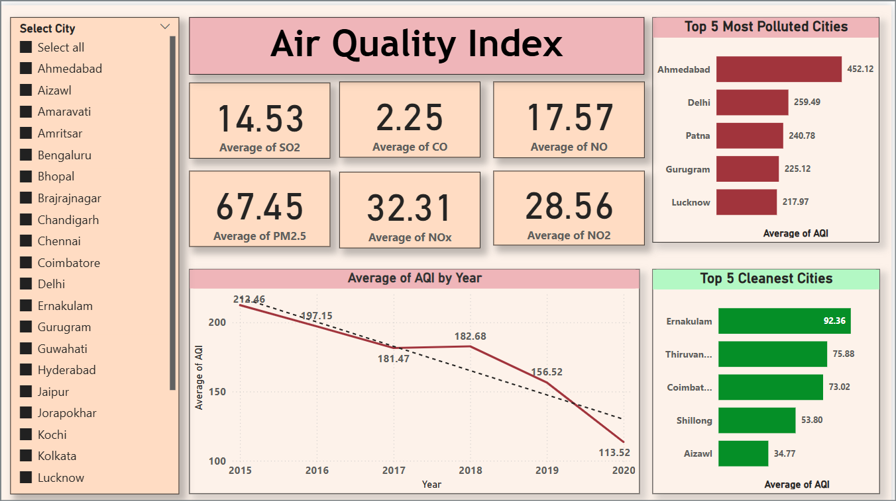

### Air-Quality-Index-Dashboard

<html>
  <body>
    

      This dashboard gives useful insights on the air quality of various Indian cities 
      based on the Air Quality Index. 
    

  It also gives insights about other parameters of air pollution such as Sulphur Dioxide, 
  Carbon Monoxide, Nitrogen Dioxide levels and so on. 

  A snapshot of the dashboard is as below: 
  

  </body>
</html>
